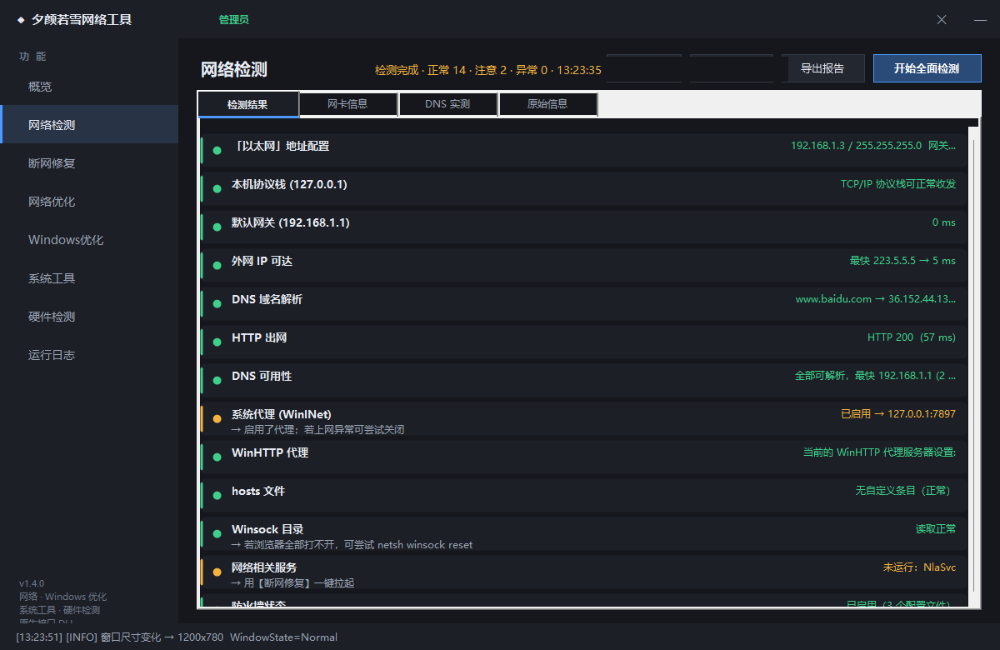
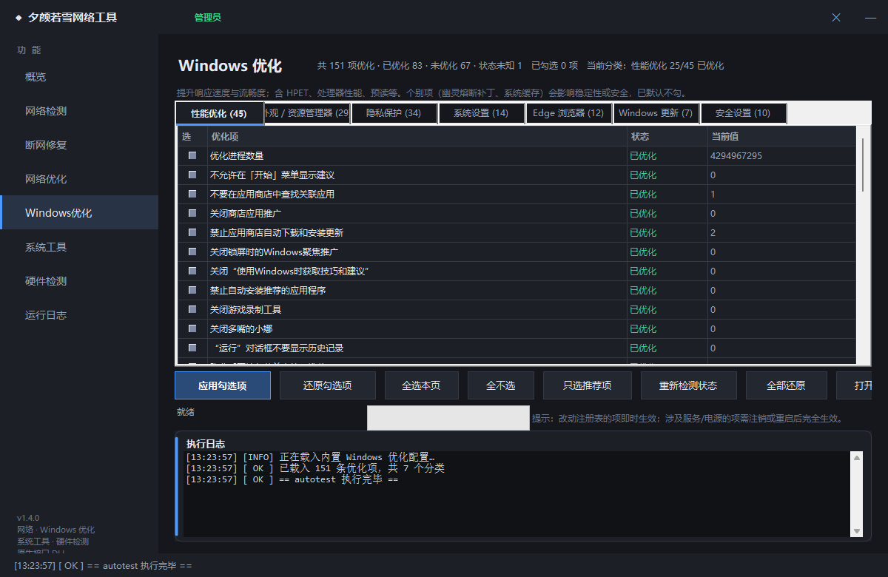
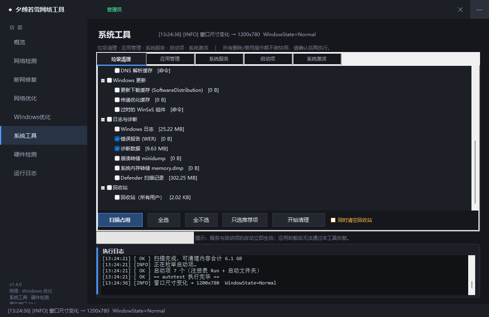
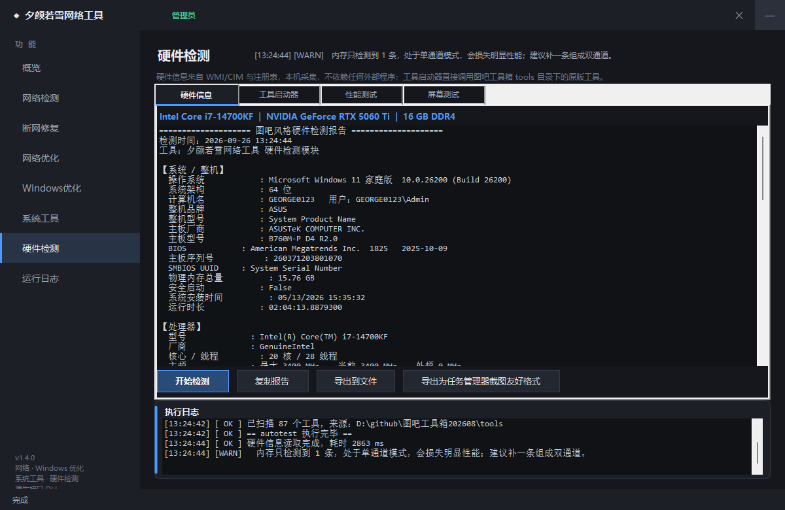
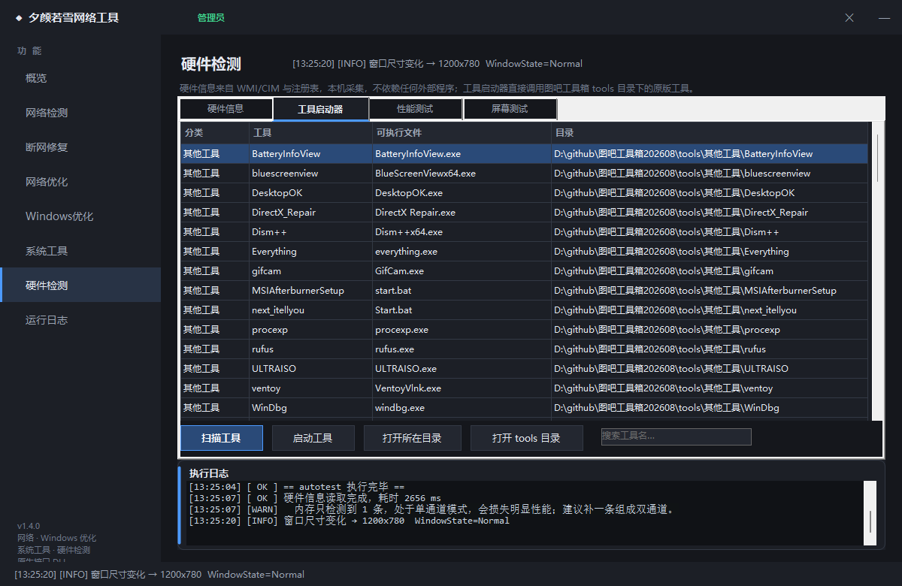

# 夕颜若雪网络工具（NetDoctor）

[中文](README.md) | [English](README_EN.md)

一个面向 Windows 10 / 11 的**一体化系统工具**：网络诊断修复、Windows 优化、垃圾清理、应用/服务/启动项管理、硬件检测与跑分。

.NET 10 + WinForms 编写，**单文件自包含发布**，目标机器无需安装任何运行时。界面为自绘暗色主题，无边框窗口。

```
概览 · 网络检测 · 断网修复 · 网络优化 · Windows优化 · 系统工具 · 硬件检测 · 运行日志
```

## 界面预览

| 网络检测 —— 分层定位断网原因 | Windows 优化 —— 151 项，实时状态 |
|---|---|
|  |  |

| 系统工具 —— 垃圾清理（先测占用再清理） | 硬件信息 —— WMI / 注册表 / EDID / SMART |
|---|---|
|  |  |

| 工具启动器 —— 调用本机图吧工具箱里的原版工具 |
|---|
|  |

---

## 下载

到仓库右侧的 **Releases** 页下载 `夕颜若雪网络工具.exe`（约 47 MB），**双击即可运行**，无需安装 .NET。

首次运行会请求管理员权限（修复、优化、服务、启动项、清理都依赖管理员权限）。

Releases 里同时提供 **`NetDoctorNative.dll`** —— 给 32 位易语言程序调用的原生接口库，
详见 [原生接口文档](docs/原生接口.md) 与 [易语言接入指南](docs/易语言接入.md)。

版本历史见 [CHANGELOG.md](CHANGELOG.md)。

---

## 两种使用形态

| 形态 | 产物 | 适用场景 |
|---|---|---|
| **独立程序** | `夕颜若雪网络工具.exe`（47 MB 单文件自包含） | 直接双击使用，自带 8 个页面的完整界面 |
| **原生接口库** | `NetDoctorNative.dll`（6.2 MB，x86） | 给**易语言**等 32 位程序 `LoadLibrary` 调用，功能长在别人界面里 |

原生 DLL 的要点：

- **NativeAOT 编译**，是真正的原生 x86 DLL，**宿主无需安装 .NET 运行时**
- **17 个正式 `__stdcall` 导出**（另加 1 个诊断导出 `NDX_ReadString`），
  统一返回 **UTF-8 JSON**，内存由 DLL 自管
- 非法指针、畸形 JSON、参数极值均安全返回，**绝不崩溃宿主**
- 与主程序**共用同一份 Core 源码**，不复制代码
- 三层测试守着：契约 **32 项**、压力/边界 **40 项**、页边界探测 **12 种布局**，全部通过

> 「绝不崩溃宿主」这句话是被测试逼出来的。入参读取这一小段代码前后修了两轮：
> 第一轮只校验起始页，于是「字符串从页尾开始」的布局会把宿主进程直接干掉；
> 第二轮按页整块读取，又把 `\0` 之后的字节一起带回，尾部多余 NUL 让 JSON 解析
> 抛异常 —— 参数传对了，功能却毫无反应。现在改用内核校验的读取方式，
> 并有独立进程的页边界探测兜底。

```c
const char* ND_Ping(void);                          // 自检，返回 pong
const char* ND_Version(void);                       // 版本 / 位数 / 是否管理员
const char* ND_DiagNetwork(int dnsTest);            // 网络诊断
const char* ND_FixNetwork(int mode);                // 断网修复（轻量 / 一键）
const char* ND_FixDeep(void);                       // 深度修复（重置 Winsock/TCP-IP）
const char* ND_RestoreHosts(void);                  // 还原 hosts（不可逆，需自行确认）
const char* ND_SetDataDir(const char* dir);         // 指定数据目录
const char* ND_DnsBenchmark(int applyBest);         // DNS 择优测速
const char* ND_DnsRestore(void);                    // 恢复自动获取 DNS
const char* ND_CleanScan(void);                     // 清扫目标占用扫描（只读）
const char* ND_CleanRun(const char* names, int rec);// 执行清理
const char* ND_Hardware(int compact);               // 硬件检测
const char* ND_OptList(void);                       // 151 项优化状态
const char* ND_OptApply(const char* names, int rst);// 应用 / 还原优化项
const char* ND_Services(const char* filter);        // 枚举服务
const char* ND_Startup(void);                       // 枚举启动项
void        ND_Free(void);                          // 释放返回缓冲区
```

---

## 功能

### 网络

| 页面 | 说明 |
|---|---|
| **网络检测** | 分层定位断网原因：协议栈 → 网关 → 外网 → DNS → HTTP 出网；逐个实测本机 DNS 服务器响应速度；**代理探测**（发现系统代理指向 `127.0.0.1` 但端口不通时直接指出这就是打不开网页的原因）；hosts / Winsock / 服务 / 防火墙 / 默认路由 / 网卡节能检查。只读，不改任何设置。可导出报告、复制摘要。 |
| **断网修复** | 一键修复（刷新 DNS → 修 169.254 → 清 ARP → 关代理 → 拉起网络服务）；10 个可单独勾选的修复项（含重置 Winsock / TCP-IP）；按症状快速处置；深度修复含一键重启。**改前自动写状态快照**。 |
| **网络优化** | 12 个公共 DNS 并发测速择优一键切换；TCP 参数调优（响应优先 / 吞吐优先 / 还原默认）；关闭网卡节能；按连接数查看占用网速的进程。 |

### Windows 优化

**151 项优化**，7 个分类（性能 45 / 隐私 34 / 外观与资源管理器 29 / 系统 14 / Edge 12 / 更新 7 / 安全 10）。

- 每行实时读取注册表显示**当前状态**（已优化 / 未优化）与**当前值**
- 支持四种操作：注册表读写（含 Wow64 视图）、服务启动类型（禁用时同步停止服务）、生效命令（`powercfg` / `net` / `netsh wfp`）、关联变更通知
- 「只选推荐项」自动排除会降低系统防护的条目（关防火墙、关内存完整性、关虚拟化安全、UAC 从不通知等，界面标红并默认不勾）
- 记**优化前原值快照**，支持单项还原 / 全部还原为 Windows 默认
- 配置为项目自建格式 `src/Data/Optimizations.xml`，可直接编辑扩充

### 系统工具

| 子页 | 说明 |
|---|---|
| **垃圾清理** | 24 个清理目标，选中即**实时计算占用**再决定是否清理。回收站与 .NET NativeImages 缓存默认不勾（后者删掉会让 .NET 程序首次启动变慢）。被占用文件自动跳过并如实报告，不会删掉自身日志目录。 |
| **应用管理** | 枚举全部 Appx 应用并显示**真实占用**，按大小倒序；批量卸载含预装包移除，卸载后逐个复核是否真的消失。 |
| **系统服务** | 枚举服务，读 `Start` 注册表值显示**真实启动类型**；启停 / 改启动类型；内置 20 个可安全禁用的服务推荐（逐条列用途，不存在的自动跳过）。 |
| **启动项** | 注册表 Run/RunOnce（HKCU + HKLM + WOW6432Node）+ 启动文件夹 + 计划任务；禁用使用 Windows 官方 **StartupApproved** 机制，**不改动原始注册表项**，随时可恢复。 |
| **系统激活** | 不内置激活脚本，自动搜索本机已有的 `MAS_AIO_CN.cmd` 并调用；可查当前许可状态（`slmgr /dli`）。 |
| **安全中心** | Defender 只读体检：引擎文件与平台目录、关键进程、服务与驱动、禁用策略、已注册杀软。**不依赖 Defender 服务存活**即可给出结论（服务不可用时 cmdlet 全部报错，只看它们等于没查）。识别「第三方杀软接管」时会核实其进程确实在运行，避免把卸载残留当成有效防护。**不提供关闭 Defender 的功能** —— 那会降低本机安全性，且实测普通管理员权限下也做不到（该注册表键归 SYSTEM 所有且 ACL 受保护）。 |

### 硬件检测

| 子页 | 说明 |
|---|---|
| **硬件信息** | 全部来自 **WMI/CIM + 注册表**，本机采集零上传：系统/整机/主板/BIOS/UUID、CPU（核心线程缓存负载）、内存（DDR 代际自动识别 + **单双通道判断**）、显卡（**显存**）、硬盘（**SMART 健康度/温度/通电小时/磨损度**）、分区、显示器（**EDID 面板型号/生产年月/物理尺寸**）、网卡、声卡、电池健康度、温度传感器。支持导出报告与紧凑格式。 |
| **工具启动器** | 扫描本机已安装的图吧工具箱 `tools` 目录，按分类列出其中的原版工具并直接启动，**不复制不修改**任何第三方程序。 |
| **性能测试** | CPU 跑分（SHA256 单/多线程吞吐 + 浮点，给出多线程加速比）；磁盘顺序读写测速（临时文件自动删除）。 |
| **屏幕测试** | 全屏纯色查坏点/漏光、灰阶渐变查色带、三级网格查几何失真与摩尔纹、多字号文字清晰度测试。ESC 退出。 |

---

## 构建

需要 **.NET 10 SDK**（Windows）。
构建原生 DLL 还需要 **Visual Studio 的 C++ 生成工具 + Windows SDK**（NativeAOT 依赖 MSVC 链接器）。

```powershell
git clone https://github.com/George01230123/NetDoctor.git
cd NetDoctor

# 只构建主程序
dotnet build src/NetDoctor.csproj -c Release
.\src\bin\Release\net10.0-windows\夕颜若雪网络工具.exe

# 构建 x86 原生 DLL（给易语言用）
dotnet publish native/NetDoctorNative.csproj -c Release -r win-x86
.\native\bin\Release\net10.0\win-x86\publish\NetDoctorNative.dll

# 一键发布：主程序 + 原生 DLL + 跑原生调用测试
.\publish.ps1

# 只想发主程序（没装 MSVC 时）
.\publish.ps1 -SkipNative
```

### 自测

```powershell
# 1) 核心引擎自测（24 组 44 项断言）
dotnet build selftest/SelfTest.csproj -c Release
.\selftest\bin\Release\net10.0-windows\NetDoctorSelfTest.exe

# 2) 原生 DLL 契约测试（x86 宿主，模拟易语言调用，32 项断言）
dotnet publish native-test/NetDoctorNativeTest.csproj -c Release -r win-x86
.\native-test\bin\Release\net10.0\win-x86\publish\NetDoctorNativeTest.exe

# 3) 原生 DLL 压力/边界测试（野指针、页边界、3000 轮模糊、资源泄漏，40 项断言）
dotnet publish native-test/StressTest.csproj -c Release -r win-x86 -o _t\stress
.\_t\stress\NetDoctorStressTest.exe

# 4) 页边界探测（12 种指针布局，逐个用独立进程跑，任何一次崩溃即失败）
dotnet publish native-test/CrashProbe.csproj -c Release -r win-x86 -o _t\probe
#    布局：z=空指针 1=0x1 m=0xFFFFFFFF s=0x1000 h=0xDEADBEEF t=0x40000000
#          p=页尾无终止符 q=页尾+次页不可访问 y=跨页合法JSON w=跨页只读字符串
.\_t\probe\CrashProbe.exe q
```

四个都跑真机实测（网卡 / 连通性 / DNS / 服务 / 启动项 / Appx / 计划任务 / 硬件 / 跑分 / 清理测量），
退出码非 0 表示有失败项。

> 后两个是**异常路径**测试。正常流程测试永远测不出「传个野指针就把宿主进程干掉」
> 这类问题 —— 而 `AccessViolationException` 在 NativeAOT 下无法 `catch`，
> 一旦发生就是整个工具箱闪退。页边界探测必须用独立进程逐个跑，
> 否则第一个崩掉之后，后面的布局就再也测不到了。

---

## 项目结构

```
NetDoctor/
├── src/                         主程序（WinForms，8 个页面）
│   ├── Program.cs  Theme.cs  app.manifest
│   ├── Core/                    ★ 引擎层，主程序与原生 DLL 共用
│   │   ├── NetworkDiag.cs        网络诊断
│   │   ├── NetworkRepair.cs      修复 + 快照
│   │   ├── NetworkOptimizer.cs   DNS 测速 / TCP 调优
│   │   ├── WindowsOptimizer.cs   151 项优化引擎
│   │   ├── JunkCleaner.cs        垃圾清理
│   │   ├── SystemItems.cs        Appx / 服务 / 启动项 / 计划任务
│   │   ├── HardwareInfo.cs       硬件信息
│   │   ├── ToolLauncher.cs       工具启动器 + 跑分
│   │   ├── Interop.cs            P/Invoke 声明
│   │   ├── Cmd.cs                命令执行 + 日志 + 内嵌脚本释放
│   │   └── nettop.ps1  sysitems.ps1
│   ├── UI/                      界面层（页面 + 自绘控件）
│   └── Data/Optimizations.xml   优化定义（自建格式，可编辑）
├── native/                      ★ 原生 DLL 工程（NativeAOT, x86）
│   ├── NetDoctorNative.csproj
│   ├── ExportApi.cs             导出层（__stdcall + JSON 缓冲）
│   └── NativeApi.cs             接口实现（复用 src/Core）
├── native-test/                 原生 DLL 的 x86 调用测试宿主
├── selftest/                    核心引擎自测工程
├── docs/
│   ├── 使用说明.md               完整中文手册
│   ├── 原生接口.md               ★ DLL 接口设计文档
│   └── 易语言接入.md             ★ 易语言调用示例与避坑清单
├── publish.ps1                  一键发布
└── .github/workflows/           CI：构建 + 自测 + Release
```

---

## 运行时生成的目录

程序会在 exe 同级创建：

```
logs/        运行日志（每天一个文件）
backup/      改动前快照，可对照回滚
.runtime/    内嵌 PowerShell 脚本的释放目录（首次运行自动生成）
```

**所有写操作**都会在 `backup/` 下留快照：代理设置、TCP 参数、每块网卡配置、默认路由、hosts，以及每个优化项的注册表原值。

---

## 关于第三方

- 本程序**不包含、不调用、不修改**任何第三方优化/工具软件的可执行文件。
- 「Windows 优化」的注册表条目、「垃圾清理」的清理目标、「系统工具」的各功能，均为本项目自行实现。
- 「硬件检测 → 工具启动器」只负责**启动**用户本机已安装的图吧工具箱里的原版工具，不复制其文件。
- 详见 [NOTICE.md](NOTICE.md)。

## 免责声明

系统优化类操作会修改注册表与服务配置，**请在使用前自行备份重要数据**。
作者不对因使用本工具造成的任何数据丢失或系统异常负责。使用即表示你已理解并接受此风险。

## 许可

[MIT License](LICENSE)
